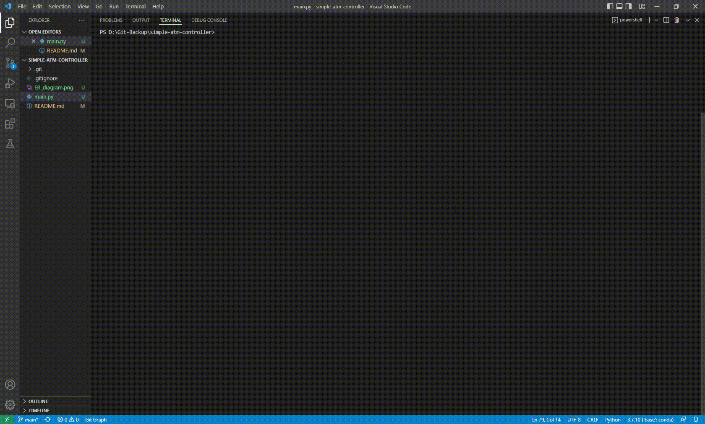

# Simple-ATM-Controller

This code was written in python 3.7.10.

## Implementation
1. Insert Card
2. Enter and Verify PIN 
3. Select Account
4. See Balance
5. Deposit
6. Withdraw

## ER Diagram


## Installation and Excecution
clone this repository and execute `main.py`.

```python
git clone https://github.com/oikosohn/simple-atm-controller
cd simple-atm-controller
python main.py
```

## Demonstration

